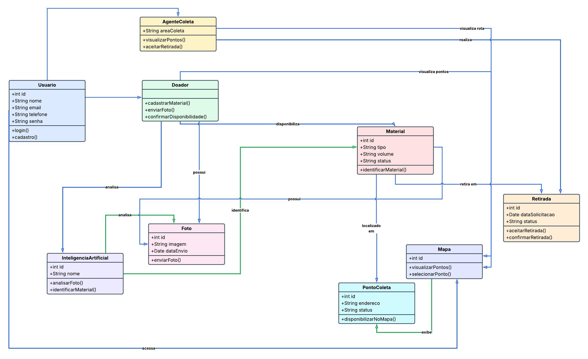

## Arquitetura 

As decisões do EcoMap foram definidas com base nas necessidades dos dois principais usuários da plataforma: doador e agente de coleta. O fluxo permite que o usuário escolha seu perfil e siga uma jornada específica para sua função. Para o doador, também foi considerada a possibilidade de o material não ser identificado, utilizando o WALL-E para auxiliar na identificação por imagem. Dessa forma, o sistema busca tornar o processo de descarte e coleta mais simples, organizado e acessível.

